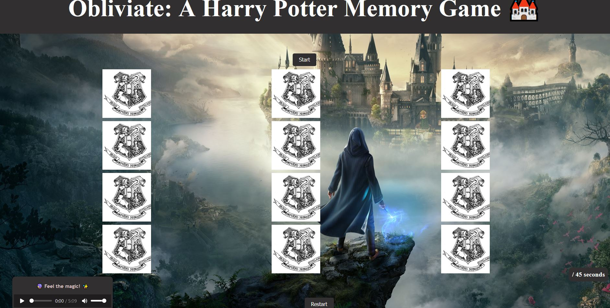

# A Harry Potter Memory Game

Welcome to Obliviate, a memory game based on the Harry Potter universe!

### Description:

Obliviate is a memory game where players try to match pairs of Harry Potter character cards. It's a fun and challenging game suitable for all ages and remember Muggles are not allowed !

### Features:

    - Dynamic card generation
    - Timer and score tracking
    - Restart functionality
    - Notification system for game events

### How to Play:

    - Grab your wand and say the magical spell "I solemnly swear I am up to no good" to unlock the secrets of Obliviate!
    - Click the Start button to begin the game.
    - Click on cards to flip them and reveal the characters.
    - Try to match pairs of identical characters.
    - The game ends when all pairs are matched or time runs out.

### Installation:

    - Clone the repository: git clone 
    - Open the index.html file in your web browser.

### Technologies Used:

    - HTML
    - CSS
    - JavaScript

If you find any bugs or have suggestions for improvements, please open an issue or submit a pull request.
